# *Dictionary Project* (CRUD)

In this article, I will explain the concept of creating and selecting the data structure of the web app Dictionary.

## *Concept & Data Structure*

Since I want to create a web app and it is easy to develop and organize various files and folders, I choose to use the django framework to create it because it saves time in sorting and creating various folders or configuring settings. of the program, so I thought using django would be the answer.

1. Create a file to store code commands used for CRUD or searching for vocabulary information. Including creating simulated data that is a Data Dictionary.

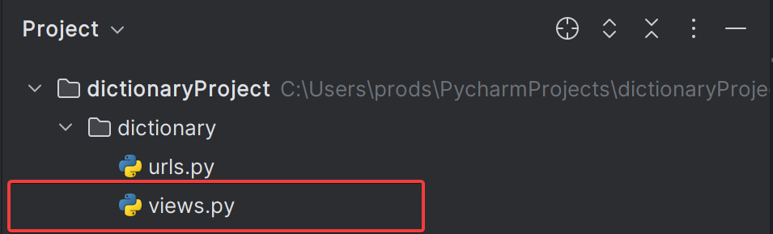

In my code example, the file name is views.py, and let's take a look at what the code inside does.

1.1 Create simulated data. The data is stored as a data dictionary because it has access to more than one data, such as translations, word types, etc. Modeling the data as a data dict makes the code easy to read and easy to retrieve the data.

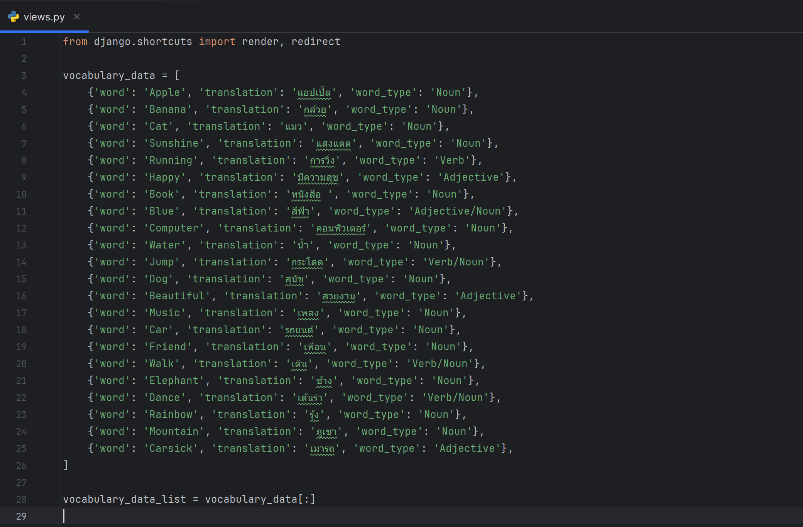

1.2 In the index function, it is responsible for arranging data and then displaying the information on the web page. In addition, you can search for words by letters. You can search for previous and next similar words.

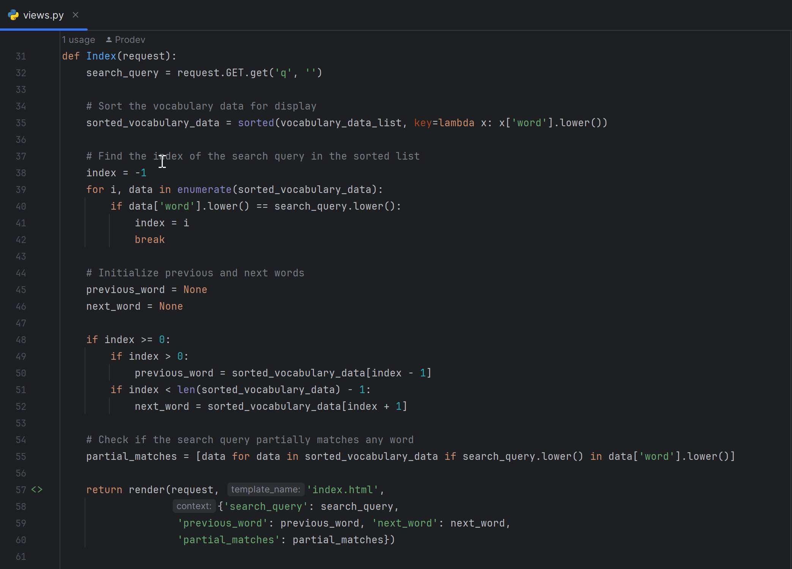

1.3 in the create_or_update function There is a check from the mode value received from the url that if it is create, it will create new data, but if it is update, it will update the value.
And the way to know which item to update is to check from the key[word] value.

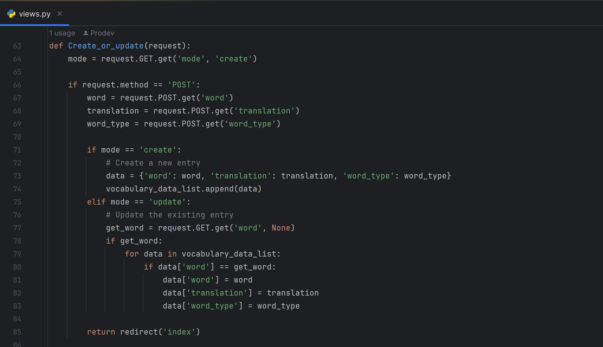

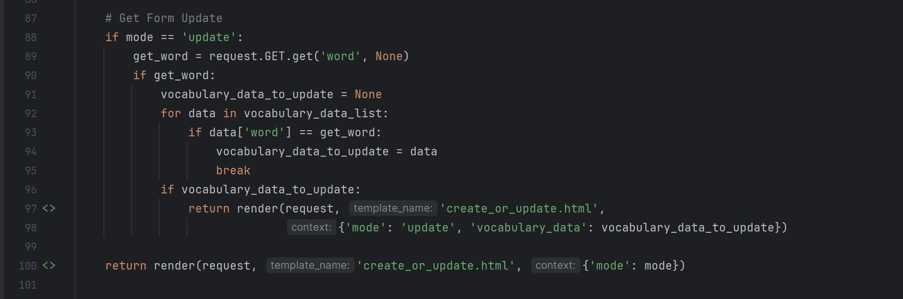

 1.4 In the Delete function, key[word] is checked. If it matches, it will be deleted.

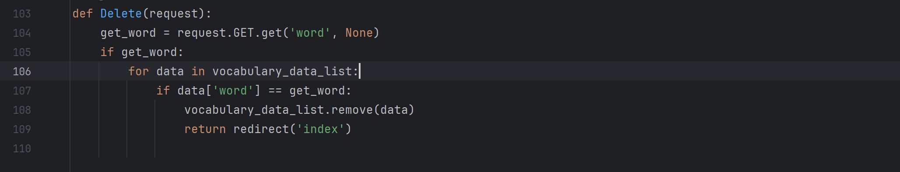

2. Create a file urls.py to specify the url or path that will link to each other. It's like an intermediary for sending various information.

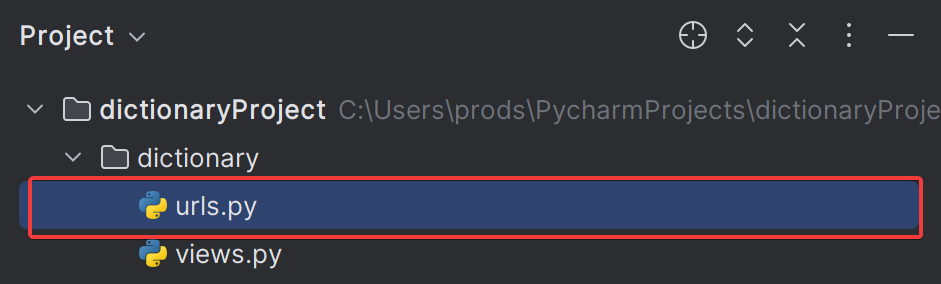

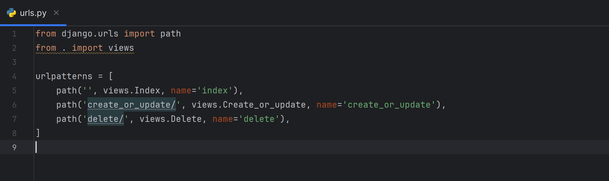

3. Create an html file in the templates folder with the name specified when returning the value in views.py.

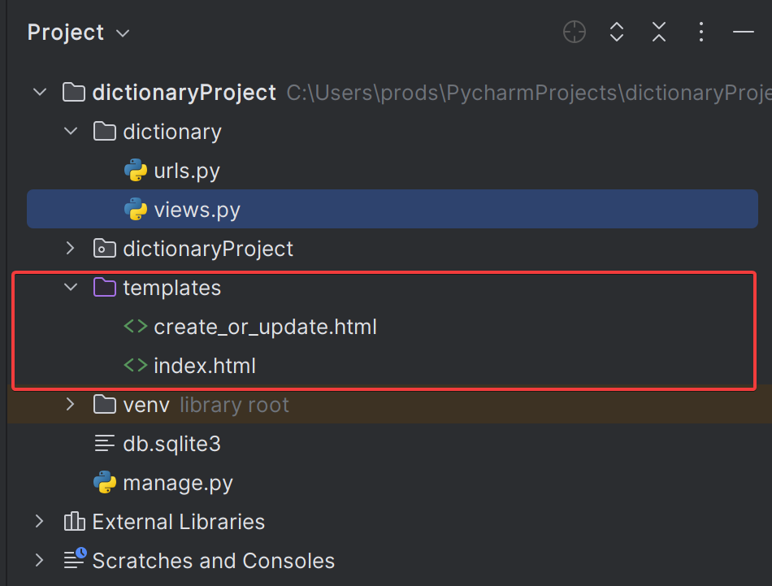

As for html, it is possible to use various logic to show information or various actions, as in the example shown in the picture:

index.html
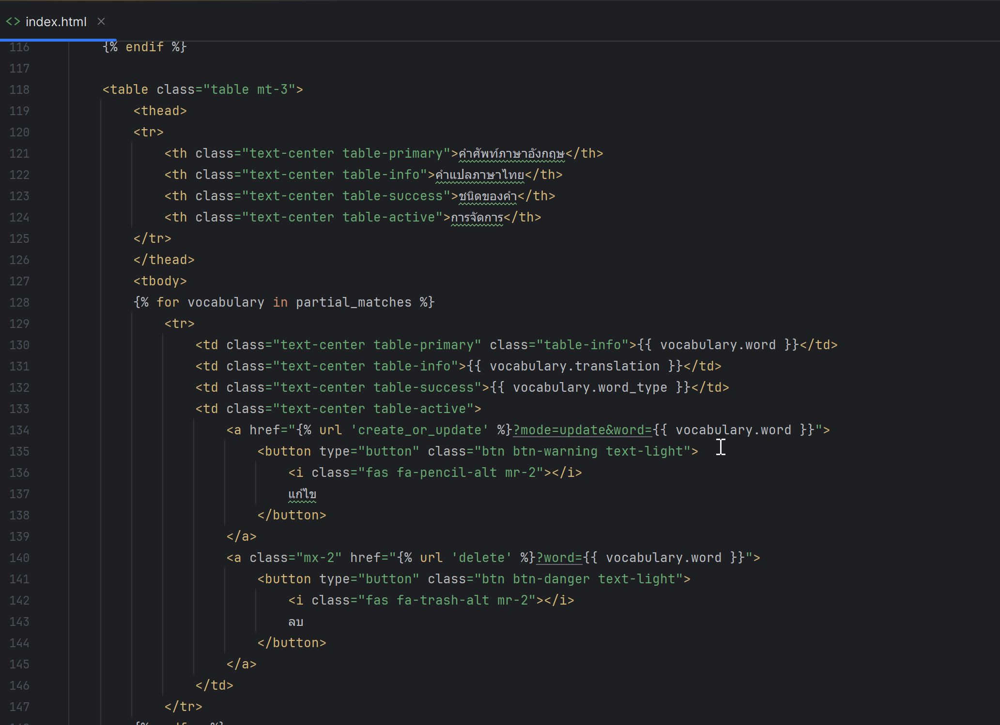

create_or_update.html
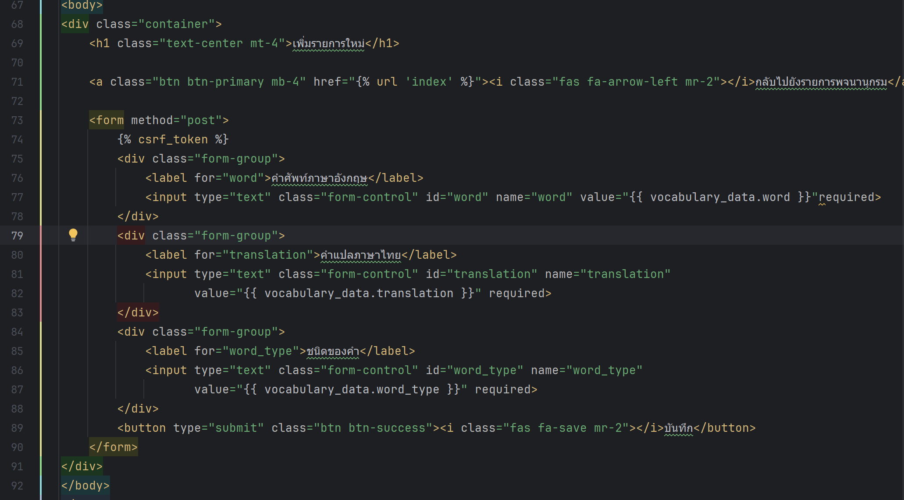

  

